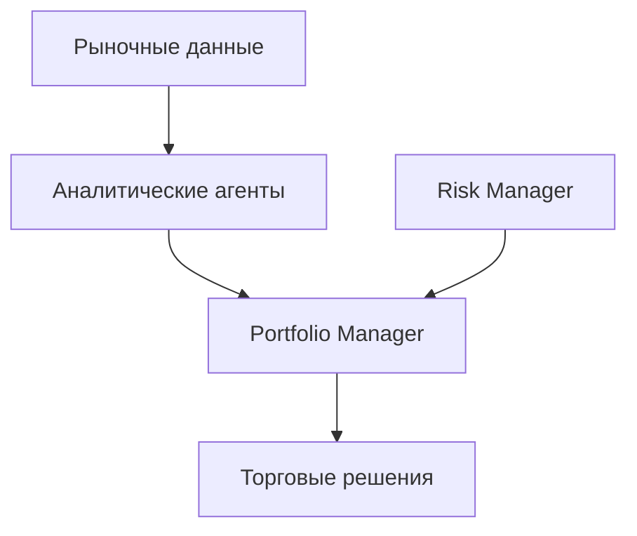

# Обзор системы агентов AI Hedge Fund

## Архитектура системы

### 1. Аналитические агенты
#### Фундаментальный анализ
- **Fundamentals Agent**
  - Анализ прибыльности
  - Анализ роста
  - Финансовое здоровье
  - Оценочные мультипликаторы

- **Valuation Agent**
  - DCF анализ
  - Оценка по методу Owner Earnings
  - Сравнение с рыночной стоимостью

#### Технический анализ
- **Technical Agent**
  - Следование тренду
  - Возврат к среднему
  - Моментум
  - Анализ волатильности
  - Статистический арбитраж

#### Стратегические агенты
- **Bill Ackman Agent**
  - Активистское инвестирование
  - Концентрированный портфель
  - Долгосрочный подход

- **Warren Buffett Agent**
  - Стоимостное инвестирование
  - Качественный анализ бизнеса
  - Долгосрочная перспектива

#### Рыночные настроения
- **Sentiment Agent**
  - Анализ новостей
  - Инсайдерские сделки
  - Рыночные настроения

### 2. Управляющие агенты
#### Управление портфелем
- **Portfolio Manager Agent**
  - Принятие торговых решений
  - Управление позициями
  - Исполнение сделок

#### Управление рисками
- **Risk Manager Agent**
  - Контроль рисков
  - Лимиты позиций
  - Диверсификация

## Взаимодействие агентов

### 1. Поток данных


### 2. Процесс принятия решений
1. **Сбор данных**
   - Фундаментальные показатели
   - Технические индикаторы
   - Рыночные настроения
   - Ценовые данные

2. **Анализ**
   - Параллельная работа аналитических агентов
   - Генерация сигналов с уровнем уверенности
   - Расчет справедливой стоимости

3. **Управление рисками**
   - Проверка лимитов позиций
   - Расчет доступных средств
   - Контроль концентрации

4. **Принятие решений**
   - Объединение сигналов
   - Учет ограничений
   - Формирование торговых приказов

## Рекомендации по настройке и оптимизации

### 1. Настройка агентов

#### Аналитические агенты
- **Fundamentals Agent**
  ```python
  # Настройка пороговых значений
  thresholds = {
      "return_on_equity": 0.15,
      "net_margin": 0.20,
      "operating_margin": 0.15
  }
  ```

- **Technical Agent**
  ```python
  # Настройка весов стратегий
  strategy_weights = {
      "trend": 0.25,
      "mean_reversion": 0.20,
      "momentum": 0.25,
      "volatility": 0.15,
      "stat_arb": 0.15
  }
  ```

- **Valuation Agent**
  ```python
  # Настройка параметров оценки
  valuation_params = {
      "growth_rate": 0.05,
      "required_return": 0.15,
      "margin_of_safety": 0.25
  }
  ```

#### Управляющие агенты
- **Portfolio Manager**
  ```python
  # Настройка торговых правил
  trading_rules = {
      "max_position_size": 0.20,  # % от портфеля
      "min_confidence": 0.70,     # Минимальная уверенность
      "rebalancing_threshold": 0.05  # Порог ребалансировки
  }
  ```

- **Risk Manager**
  ```python
  # Настройка риск-лимитов
  risk_limits = {
      "max_position": 0.20,       # Максимальный размер позиции
      "sector_exposure": 0.30,    # Максимальная экспозиция на сектор
      "min_liquidity": 1000000    # Минимальная ликвидность
  }
  ```

### 2. Оптимизация производительности

#### Параллельная обработка
```python
# Параллельный запуск агентов
async def run_analysis():
    tasks = [
        run_fundamentals_agent(),
        run_technical_agent(),
        run_sentiment_agent(),
        run_valuation_agent()
    ]
    results = await asyncio.gather(*tasks)
```

#### Кэширование данных
```python
# Кэширование финансовых данных
@cache(ttl=3600)  # 1 час
def get_financial_data(ticker: str):
    return fetch_financial_data(ticker)
```

#### Оптимизация памяти
```python
# Очистка неиспользуемых данных
def cleanup_data():
    gc.collect()
    torch.cuda.empty_cache()
```

### 3. Мониторинг и логирование

#### Отслеживание производительности
```python
# Мониторинг времени выполнения
def monitor_performance():
    start_time = time.time()
    run_analysis()
    execution_time = time.time() - start_time
    log_performance_metrics(execution_time)
```

#### Логирование решений
```python
# Логирование торговых решений
def log_trading_decision(decision):
    logger.info(f"Signal: {decision.signal}")
    logger.info(f"Confidence: {decision.confidence}")
    logger.info(f"Reasoning: {decision.reasoning}")
```

### 4. Рекомендации по развертыванию

#### Системные требования
- CPU: 4+ ядра для параллельной обработки
- RAM: 16+ GB для обработки больших датасетов
- SSD: 256+ GB для хранения исторических данных
- GPU: Опционально для ускорения ML моделей

#### Масштабирование
- Использование контейнеризации (Docker)
- Распределенное выполнение агентов
- Балансировка нагрузки

#### Безопасность
- Шифрование данных
- Аутентификация и авторизация
- Аудит действий

## Заключение

### 1. Преимущества системы
- Комплексный анализ
- Автоматизация решений
- Масштабируемость
- Гибкость настройки

### 2. Ограничения
- Зависимость от качества данных
- Необходимость регулярной калибровки
- Вычислительные требования

### 3. Направления развития
- Добавление новых агентов
- Улучшение алгоритмов
- Оптимизация производительности
- Расширение функциональности
